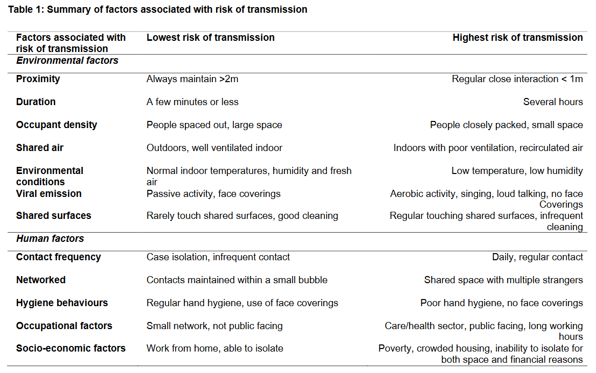

```{r setup, echo=FALSE, include=FALSE}

## To render this document from a guaranteed clean R environment, use
## the provided Makefile.

## To load all objects referenced in this file into the current R
## environment, make the following call at the R prompt:

knitr::opts_chunk$set(fig.width=7,
                      fig.height=7/(16/9),
                      dpi=200,
                      tinytex.verbose=TRUE, ## PDFs very slow to compile.
                      echo=FALSE,
                      include=TRUE,
                      results='asis',
                      cache=FALSE,
                      cache.lazy=FALSE,
                      warning=FALSE)

## Also see knitr::opts_current$get() within a chunk to inspect then-active options.

options(tinytex.verbose=TRUE,
        tinytex.clean=FALSE)

```

```{r workhorse, include=FALSE}

source("./ct-covid.R")

```

# Read This First

```{r readme, include=TRUE}

cat(paste0(readLines("readme.md", n=-1), collapse="\n"))

```

# Introduction to this Page

I started putting together graphs based on Connecticut Department of Public Health (DPH) data in late March, and I've been putting graphs up on various social media platforms since the first week of April. If you're interested in what those earlier efforts looked like, you can [find some of them on Twitter](https://twitter.com/search?q=%23Connecticut%20%23covid19%20%40davidbraze&src=typed_query). You could also [follow me on twitter](https://twitter.com/davidbraze), which is where I'll usually announce updates to this page.

Around the end of May, I got busy with other things and stopped updating this page until around mid-November. Covid activity in Connecticut had subsided after the spring surge and stayed pretty flat through the summer. But, by mid-September it seemed clear that we were in the beginnings of a second wave of infections. I finally got around to updating these graphs again around mid-November.

This web page (the one you're looking at now) is home to my most recent Connecticut Covid-19 graphs, although it won't have every figure I've built. I expect to grow the collection and add some narrative around the graphs, when I have time. Of course, I'll update the graphs as new data rolls in from the state. Don't expect web page updates to happen every day, but I guess I'll get around to it a couple of times a week. The date at the top of the page will always indicate when it was last updated. So, you should think of this web page as a "living document." It's going to change over time. And, yes, there will be typos. 

Finally, at the bottom of this page, you'll find a few general [Covid-19 resources](#resources) that might be useful to you. 

## About Me

I am a freelance consultant for hire. Most of my time in my day job is spent with research and data focused in the areas education, language, and literacy. Although, I work with data in other areas as well. You can find out more at my website and blog: [davebraze.org](https://davebraze.org/).

## Copyright & License

This page and the graphs it contains are copyright 2020-2021 by David Braze. The web page content and graphs are released under the [Creative Commons v4.0 CC-by license](https://creativecommons.org/licenses/by/4.0/).  Cutting through the legalese, it means that you're free to re-use the graphs (do what you want with them) so long as you say who made them and where you got them.

# About the Data

## CT DPH Covid19 Data 
The Connecticut Deptartment of Public Health provides its most comprehensive set of statistics for the state as a whole (no subdivision for counties or towns). As of April 1, there are four basic daily statistics available for Connecticut. These are: Number of Covid-19 ***tests completed***; Number of ***confirmed cases*** of Covid19; Number of Covid-19 related ***Deaths***; Number of Covid-19 ***Hospitalizations***. The first three statistics are all cumulative counts. In other words, each represents the total number since record keeping began. So, those numbers can only go up (or stay the same) from one day to the next. On the other hand, ***Hospitalizations*** is the number of people in the hospital on a given day. That statistic can go up or down from one day to the next. For two of the statistics, ***confirmed cases*** and ***deaths***, the state also gives the breakdown by Age, Gender, and Race. But, there are no cross-tabulations provided. Only three of those statistics are available at the county level, ***tests completed*** is not. Only ***confirmed cases*** and ***deaths*** are available for individual towns. Age, Gender, and Race breakdowns are not available for county or town data.

Another thing to keep in mind is that the numbers reported for any of these statistics is not perfect. DPH is trying to keep policy makers and the public informed in a timely way. But getting those numbers out as quickly as possible means that they are sometimes not exactly right. There has been some news coverage of [Covid-19 reporting discrepancies in Connecticut](https://www.courant.com/news/connecticut/hc-news-coronavirus-death-numbers-20200407-l5edq4vne5g3zhmcadxfrt5d2u-story.html) in local news outlets.

The number of ***confirmed cases*** is a cumulative count of people who have tested positive for coronavirus since record keeping began (about March 1). But, most people haven't been tested and there are certainly many more Covid-19 cases among Connecticut residents who have not been tested. ***Confirmed cases*** does not distinguish between people who are currently ill and people who have recovered.

The number of ***tests completed*** is the total, cumulative, number of Covid-19 tests that have been reported to the state. My understanding is that Connecticut is reporting the results of PCR-based tests that identify the virus's genetic material in people who are currently infected, but can't tell if they once had the virus and then recovered (they'll test negative). This contrasts with an antibody test which can tell if a person ever had the virus, but can't distinguish between people who are infected at time of test vs. infected as some point in the past. The PCR type is the more useful test for establishing the current rate of infection in the state. Also, up until May 3rd, the number of tests completed equaled the number of people tested, but since May 3rd some people have been tested more than once, so the number of tests completed is more than the number of people tested.

***Test positivity*** is the ratio of positive tests to all tests reported in a specific time frame (usually 1 day). For example, daily test positivity is calculated by dividing the number of positive tests reported each day (***Confirmed Cases***) by the total number of tests reported on that day (***Tests Completed***). 

The ***hospitalizations*** count is the number of people who are, on that day, hospitalized due to Covid-19. This is the only one of the 4 counts provided by Connecticut DPH that is not cumulative. Unlike some states, Connecticut does not break out how many of those are in ICU vs standard acute care (e.g., [New York](https://forward.ny.gov/daily-hospitalization-summary-region)). 

*Hospitalization rate is important* because it directly measures health outcomes of interest and is not subject to most of the measurement issues that arise with case counts and related variables (e.g., Test Positivity).

The cumulative ***deaths*** statistic is fairly self-explanatory. It is just the total number of people who have died as a result of, or while sick with Covid-19. It's worth looking at the link above on *Covid-19 reporting discrepancies in Connecticut*. Additional reporting points out that, as of May 2020, [Connecticut uses an antiquated process for compiling death certificates and reporting them to the CDC](https://ctmirror.org/2020/05/19/as-it-prepares-to-reopen-connecticuts-count-of-covid-19-deaths-is-fragmented-and-incomplete/). So, there is a significant delay in the availability of Connecticut state mortality data, which means that it is not possible to have a real-time view of the increase this year over previous years for "death from all causes." Once available, that statistic will likely give a more accurate measure of lives lost due to Covid-19 than other indicators.

The dates associated with three of these variables (tests completed, cases, deaths) is the date that they are ***reported***, not the date that they actually ***occur***. This is important for understanding why the numbers fluctuate in the way that they do. For example, from July onward there is a clear weekly cycle in the numbers. This is because beginning on July 1, the state does not report numbers on weekends or holidays. Numbers for those days are effectively zero. So from July forward, at the beginning of each week there is a 'catch-up' day and the numbers reported on that day include weekend (and possibly holiday) numbers.

Another driver of idiosyncrasy in these data is that every once in a while the state dumps a bunch of back-logged results into their data file all at once. This happened, for example on January 18 2021, resulting in an apparent huge spike in reported tests for that day. In fact, those tests are the result of a back-log that had been accumulating for quite a while. Just how long is not entirely clear to me. Other instances of data dumps to catch up with reporting back-logs are revealed in the two large spikes in deaths that we see in April.

## Map Files

The map files used in Figures \@ref(fig:map-cumcases) and \@ref(fig:map-positivity) were downloaded from the [Map and Geographic Information Center at the UConn Library](http://magic.lib.uconn.edu/).

## CT Population Data

Population data for Connecticut towns was scraped from the [Wikipedia](https://www.wikipedia.org) page [List of Towns in Connecticut](https://en.wikipedia.org/wiki/List_of_towns_in_Connecticut). Town population data corresponds to 2010 US census counts.

## Other States' Data

Case rates for other states used in Figure \@ref(fig:usa-state-corona) is downloaded from the [New York Times repository of Covid-19 data on GitHub](https://raw.githubusercontent.com/nytimes/covid-19-data/master/us-states.csv). 

# Show Me the Graphs

## Statewide Summary

While, CT DPH reports cumulative counts, these can be misleading numbers. I've plotted them just the same in Figure \@ref(fig:ct-summary-2-plt). The problem with this kind of graph is that it makes it hard to see how much the numbers are changing from one day to the next. It's easy to see the difference between cumulative and non-cumulative statistics. Cumulative counts (Cases, Deaths, Tests) can never go down, but a non-cumulative count (Hospitalizations) can decrease over time. For these I've stopped updating this figure, showing cumulative counts, as of the end of May. From the start of the pandemic throught June, DPH reported statistics 7 days a week. Beginning in July, they no longer report statistics on weekends or holidays, so stats for those days are reported on the next business day. I think Figure \@ref(fig:ct-stat-daily-change) gives a clearer view of day to day change.

```{r ct-summary-2-plt, fig.height=10.5, fig.cap="Covid-19 Cases, Hospitalizations, Deaths, & Tests completed for Connecticut through the end of May. Note different y scales."}

ct.summary.2.plt

## cat("")

```

One way to visually emphasize day to day change in the numbers is to start with the DPH's cumulative counts (and daily count, in the case of ***Hospitalizations***), and subtract the previous day's count from each number. I'm showing these day-to-day differences in Figure \@ref(fig:ct-stat-daily-change). These difference values can look a little 'spiky'. That is mostly due to to the fact that, starting in July, each Monday's reports include counts for the preceeding weekend as well. Think of it as a sort of catch up day. In order to smooth that out a bit, I've taken seven day running averages of the reported numbers and added them as dashed lines in Figure \@ref(fig:ct-stat-daily-change). Averaging in this way makes longer term trends easier to spot. It's important to keep in mind that Figure \@ref(fig:ct-summary-2-plt) and Figure \@ref(fig:ct-stat-daily-change) are based on the same underlying data. They just emphasize different aspects of it. 

Another difference between the two graphs is that Figure \@ref(fig:ct-stat-daily-change) includes a new variable, ***Test Positivity***. It is calculated as the number of ***Tests Reported*** on a given day (top panel of Figure \@ref(fig:ct-stat-daily-change)), divided by the number of ***Cases*** diagnosed on that same day (second panel of the same figure). ***Test Positivity*** is the percentage of tests that came back positive on a given day.

The most recent day's values, both the reported value and the seven day average, are labeled on the right-hand side of Figure \@ref(fig:ct-stat-daily-change). These can be compared to numbers in the table labelled "Connecticut COVID-19 Summary" at the top of the Connecticut DPH page [here](https://data.ct.gov/stories/s/COVID-19-data/wa3g-tfvc/#data-library). Keep in mind that the state page seems to be updated every weekday (but not weekends). My page, the one you're looking at now, is updated less frequently. The date at the top of this page indicates when it was last updated.

```{r ct-stat-daily-change, fig.height=10.5, fig.cap=ct.stat.daily.change.cap}

ct.stat.daily.change.plt

```

It's also interesting to look at how Connecticut is doing relative to other states. Figure \@ref(fig:usa-state-corona) shows the growth in cumulative Covid-19 cases for all 50 states. Connecticut, shown in blue, was consistently between 9th and 12th place for number of cases in the early stage of the pandemic, well into June. So, Connecticut was really outperforming, not in a good way , considering it is only the 29th most populous state.

Starting in summer, Connecticut's response to the pandemic had the effect of reducing spread of the virus, while at the same time COVID started spreading out of control in states that were less effected during the spring. Sadly, starting in November, COVID cases started increasing all across the country.

```{r usa-state-corona, fig.cap=usa.state.corona.cap}

usa.state.corona.plt

```

## Town by Town

In the following figures, I try to show how the pandemic is effecting individual towns across Connecticut. Unfortunately, detailed statistics are not available for each town, and we have to rely mostly on covid case counts, which the state does publish for each town. It should be no surprise that bigger towns tend to have more cases both across the state as a whole and within individual counties, as shown in Figures \@ref(fig:town-rate) and \@ref(fig:town-by-county-rate).

```{r town-rate, fig.cap=town.rate.cap}

town.rate.plt

```

```{r town-by-county-rate, fig.height=7, fig.cap=ct.town.by.county.rate.cap}

town.by.county.rate.plt

```

All other things being equal, you would expect larger towns to have more cases than smaller towns, and that comes out pretty clearly in Figures \@ref(fig:town-rate) and \@ref(fig:town-by-county-rate).

Figure \@ref(fig:town-by-pop-rate10k) divides Connecticut's towns up by size, grouping towns of similar size together. This let's us see how each town is doing relative to other towns of similar size.
What's more, instead of showing the crude number of cases for each town, it shows the number of cases per 10,000 population. This graph makes clear that larger towns do tend to have more cases than smaller towns, even accounting for differences in population. 

```{r town-by-pop-rate10k, fig.height=10.5, fig.cap=ct.town.by.pop.rate10k.cap}

town.by.pop.rate10k.plt

```

The map in Figure \@ref(fig:map-cumcases) shows the total cumulative number of COVID19 cases for every town in Connecticut over the entire span of the pandemic to date. So, the numbers are an indication of the total Covid-19 load in a town over the duration of the pandemic. The numbers shown for each town in the map correspond to the endpoints of the lines in Figures \@ref(fig:town-rate), \@ref(fig:town-by-county-rate).

```{r map-cumcases, fig.height=7, fig.cap="Cumulative Covid-19 Cases for each Connecticut Town from the Beginning of the Pandemic."}

map.cumcases

```

Figure \@ref(fig:map-positivity) shows the average Covid-19 Test Positivity for the most recent 10 day period with available data. In contrast to the map in Figure \@ref(fig:map-cumcases), Figure \@ref(fig:map-positivity) gives an indication of where the ***current*** covid hotspots are in the state. Under ideal circumstances, Test Positivity is an estimate of the percentage of a town's population that is infected with Covid-19 when the Test sample is collected. In some circumstances, Test Positivity may not be a good estimate of prevalence. For example, if not enough testing is being done in an area, then TP will not give a reliable estimage of COVID-19 prevalence.

```{r map-positivity, fig.height=7, fig.cap=map.positivity.cap}

map.positivity

```

# General Covid-19 Resources {#resources}

## How Covid-19 Spreads

There is a nice blog post by Erin Bromage, PhD in microbiology and immunology, detailing what we knew in early May about how person-to-person transmission of Covid-19 actually happens. It includes specific information on what the experts know about which situations are more risky, and which ones are less risky: <https://www.erinbromage.com/post/the-risks-know-them-avoid-them>. This is a great article for people who are worried about how to manage risk for themselves and their loved ones as governments start to scale back on Covid-19 restrictions on movement and business activities. 

Bromage got it mostly right, but we have learned some things about COVID transmission since then. The table below is taken from a research summary of what is known about COVID transmission routes as of October 22, 2020. You can get the source document [here](https://www.gov.uk/government/publications/sars-cov-2-transmission-routes-and-environments-22-october-2020).



## Plans for Re-opening

Keeping people at home and cutting back on public activities, including some kinds of business activities, was always intended as a temporary measure. The point of it is to keep the healthcare system from being overloaded and to allow time to build capacity for managing the spread of Covid-19. The question has always been how and when to re-open. It was never about whether or not to re-open at all. So, how do we move beyond the emergency situation with some businesses closed and many people sheltering in place?

Several credible road maps have been proposed for how and when to re-open in a responsible way. Here are three of them:

* American Enterprise Institute: https://www.aei.org/research-products/report/national-coronavirus-response-a-road-map-to-reopening/
* Johns Hopkins University School of Public Health: https://www.centerforhealthsecurity.org/our-work/publications/public-health-principles-for-a-phased-reopening-during-covid-19-guidance-for-governors
* Duke University Center for Health Policy: https://healthpolicy.duke.edu/sites/default/files/atoms/files/covid-19_surveillance_roadmap_final.pdf

What they all have in common are specific milestones to use for deciding when and how to phase in re-opening across different parts of the country, ***after*** the spread of Covid-19 has been brought under control. 

On May 18th, [Governor Lamont issued executive order 7PP](https://portal.ct.gov/-/media/Office-of-the-Governor/Executive-Orders/Lamont-Executive-Orders/Executive-Order-No-7PP.pdf), which introduced rules for a phased re-opening of activity within
the state, by business sector. Those rules are available here: [Sector Rules for Re-opening](https://portal.ct.gov/DECD/Content/Coronavirus-Business-Recovery/Sector-Rules-for-May-20-Reopen). As far as I can tell, the rules don't differentiate at all by region, even though some parts of the state (e.g., some counties) are clearly more impacted by Covid-19 than others. 

```{r eval=FALSE}

## More info on re-opening here: https://twitter.com/cmyeaton/status/1258512373750435842?s=20

## NYC data: https://github.com/nychealth/coronavirus-data

## NYS dashboard: https://forward.ny.gov/regional-monitoring-dashboard

## Estimate of transmission rate for each US state in "real-time": https://rt.live/

``` 

```{r eval=FALSE}

## Kids and Schools

## A recent study finds "For counties whose pre-opening total new COVID-19 hospitalization rates were below roughly 36-44 per 100,000 population per week (roughly the 75th percentile of counties during the summer), we find no effect of in-person school reopening on COVID-19 hospitalization rates. For these counties, the estimates are robust to alternative school reopening and hospitalization data sources, the addition of controls for general state social distancing policies and college opening modes, and alternative estimation methods. For counties where total baseline new hospitalizations are above the 36-44 new hospitalizations per 100,000 per week, the estimates are inconsistent across methods and are therefore inconclusive." https://www.reachcentered.org/publications/the-effects-of-school-reopenings-on-covid-19-hospitalizations

## Another study reports "in-person modality options are not associated with increased spread of COVID at low levels of pre-existing COVID cases,  but cases do increase at moderate to high pre-existing COVID rates." https://caldercenter.org/sites/default/files/WP%20247-1220_updated_typo.pdf

## A lay person's outline of the preceeding two studies summarizes them "Reopening schools in areas with higher caseloads, though, does spread the virus, one found, while the other couldn’t rule out that possibility. It remains unclear exactly at what point school reopening becomes more risky." https://www.chalkbeat.org/2021/1/4/22214312/covid-spread-schools-research


```
